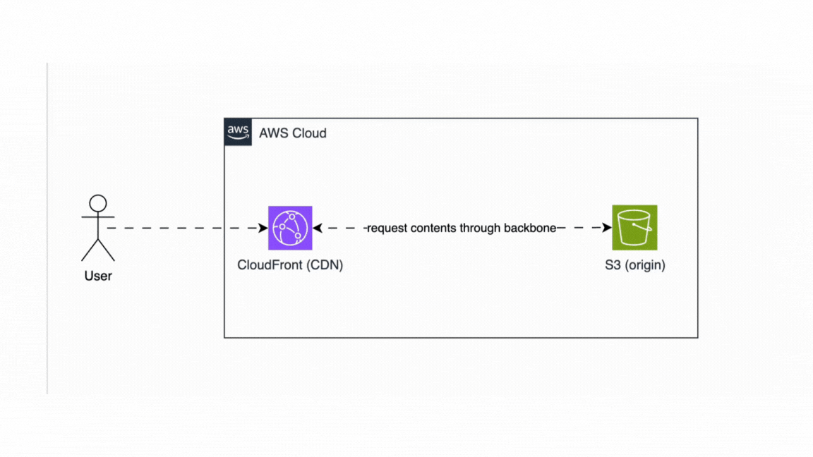

# Fast static Pokemon site with Edge Locations

## Table of contents

- [Architecture](#architecture)
- [Technologies used](#technologies-used)
- [Terragrunt folder structure](#terragrunt-folder-structure)
- [Development guide](#development-guide)

## Architecture



## Technologies used

- AWS Services: CloudFront, S3
- IaC: Terragrunt

## Terragrunt folder structure

```bash
.
├── README.md
├── architecture.drawio              # drawio architecture file
├── modules                          # reusable, core Terraform code imported into specific infrastructure units
│   ├── cdn
│   │   └── main.tf
│   └── s3
│       └── main.tf
├── production                       # AWS account folder
│   ├── account.hcl
│   └── ap-southeast-1               # AWS region
│       ├── production               # AWS environment
│       │   ├── cdn                  # AWS CloudFront for delivering assets through CDN
│       │   │   └── terragrunt.hcl
│       │   ├── environment.hcl
│       │   └── s3                   # AWS S3 for storing static web page
│       │       └── terragrunt.hcl
│       └── region.hcl
├── staging                          # AWS account folder
│   ├── account.hcl
│   └── ap-southeast-1               # AWS region
│       ├── staging                  # AWS environment
│       │   ├── cdn                  # AWS CloudFront for delivering assets through CDN
│       │   │   └── terragrunt.hcl
│       │   ├── environment.hcl
│       │   └── s3                   # AWS S3 for storing static web page
│       │       └── terragrunt.hcl
│       └── region.hcl
├── public                           # static assets will be imported into AWS S3 bucket
│   ├── images
│   │   └── pokemon.jpg
│   ├── index.html
│   └── styles.css
├── root.hcl                         # The foundational Terragrunt configuration file at the project's root.
│                                    # It serves as a central point for collecting and propagating variables down the configuration hierarchy,
│                                    # following a logical flow: account-level settings are defined or referenced here, which then cascade to region-specific configurations,
│                                    # followed by environment-specific settings, and finally to the individual unit or module deployments.
│                                    # This promotes consistency and reduces redundancy across your infrastructure definitions
│
├── scripts                          # custom bash scripts
    └── deploy.sh                    # upload statics files and invalidate AWS CloudFront
```

## Development guide

1. Git clone this repo
2. Move to working directory `cd ./production/ap-southeast-1/production` (production environment) or `cd ./staging/ap-southeast-1/staging` (staging environment)
3. Plan all units(modules) `terragrunt run-all plan`
4. Apply all units(modules) `terragrunt run-all apply`
